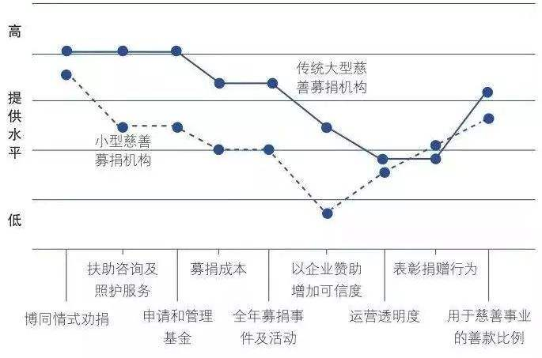

# 战略布局图 #

战略布局图描绘了竞品针对用户的配置方式及对比关系。它清晰明了地呈现了竞争元素、为用户提供这些元素的水平、各个竞品各自的价值曲线。它让我们能够看到并理解竞争对手当前的资源投入方向，行业竞争所关注的产品、服务、配送方面的元素，以及顾客从相互竞争的现有产品上得到了什么。

下图展示的是以往英国慈善募捐业的战略布局图。

横轴上列出了产业的竞争和投入元素。**请注意，横轴上的关键元素是从卖方所关注并以为能够提供价值的竞争元素，而不是买方真正看重的影响购买决策的元素。**

很多时候企业关注的竞争元素不仅不能增加用户价值，还有可能减损用户价值。**战略布局图要揭示的是卖方竞争的焦点，而不是用户关注的因素。**

例如：慈善机构的两个竞争焦点，全能举办募捐活动和营销式劝捐，令捐助者产生心理疲劳，并不能激发他们的捐赠热情。再如，我们付费的电视台提供的一大堆节目频道，而我们真正想要的只有喜欢的节目的那三、四个频道。

战略布局图**纵轴表达了买方在每个关键竞争元素上所得到或体验到的水平。**纵轴上的分值高，表明一个组织在相应的关键元素上提供给买方的水平高，而相对较低的分值则意味着提供的水平低。

将这些点连起来，就得到了战略轮廓曲线（价值曲线），它以图像形式描述竞品在行业里各个竞争元素上的相对表现。

### 作用 ###

战略布局图让我们能够捕捉和描绘行业当前状况的宏观全景，而不至于在运营微小差别的技术细节中迷失方向。

重要的是，我们通过关注产业战略轮廓的基本形状，识别出应该剔除、增加、减少、创造哪些元素，以形成独特的价值曲线去挑战和改变行业的基本战略规范，进而实现价值创新。

### 方法 ###

绘制战略布局图首先要针对竞品找到它主要竞争元素。不同竞品的竞争元素可能会有很大差别，在实际操作中，主要从竞品当前的资源投入方向来找出这些元素。我们把竞争元素也归类为[关键因素](demand/kf.md)中的一种，这样利于对竞争和需求的统一分析。

找出竞争元素后，根据竞品在每个元素上的提供水平，看其属于“极低”、“低”、“一般”、“高”、“极高”哪个区间，在对应区间标记记号。

最后把这些记号连成一条曲线，就完成了该竞品的价值曲线的绘制工作。将多个竞品的价值曲线绘制在一起就形成了整个行业的战略布局图。