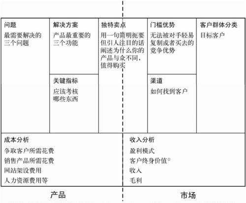

# 精益画布 #

精益画布是用来规划和分析产品商业模式的工具。与[商业模式画布](/util/businessModelCanvas.md)比起来，精益画布更侧重于产品层面的商业模式。

精益画布由9个模块构成:

**1.问题**

针对每个目标客户群体，阐述他们最需要解决的一到三个问题。

**2.客户群体分类**

你的目标用户是谁？这些用户有哪些关键的特征？

**3.独特卖点**

为什么用户要选择你的产品而不选竟品？你能以清晰、独特、令人印象深刻的方式说明为何你的产品更加优异或者卓尔不群吗？

**4.解决方案**

你为现存问题提供的解决方案是什么？

**5.渠道**

如何将产品或服务送到用户手中，又如何收取用户支付的款项？如何与用户保持连接？

**6.关键指标**

哪些数据指标能让你了解产品的真实状况？

**7.竞争壁垒**

如何为产品构建“护城河”？无法被对手轻易复制或买去的竞争优势有哪些？

**8.成本分析**

做这个产品的直接成本和间接成本都有哪些？

**9.收入分析**

产品如何赚钱？收入能大于成本吗？何时能达到盈亏平衡？

这9个模块覆盖了产品营销过程里需要思考的3个核心问题：创造价值（问题、用户细分、独特卖点、解决方案）、传递价值（渠道、关键指标）和获取收益（成本分析、收益分析）。

### 作用 ###

营销者在思考与规划一个产品时，要建立产品的全局观：不仅要考虑用户需求，还要考虑产品的技术可行性与商业可行性。

如果缺乏产品全局观，在分析产品时会没有头绪或者遗漏一些重要信息。

通过应用精益画布，我们可以建立起合理的产品全局观，从而规划出具有高营销水平的产品。

在工作中，精益画布有如下适用场景：

**产品规划：**编写商业需求文档、立项报告、商业计划书，向他人介绍商业模式。

**分析竞品：**在竞品分析时，用精益画布可以从全局的角度多方面地分析竞争对手的产品，这一点是功能拆解、客户标准评分等分析方法所做不到的。

### 方法 ###

使用精益画布需要注意如下事项：

1.精益画布的9个模块有数字顺序，在填写精益画布或向别人介绍精益画布时，按照数字顺序填写会更有逻辑。

2.平台类的产品，如“淘宝电商”，会涉及多边用户：买家、卖家，他们的需求各不相同，所以要分别为买家和卖家制作精益画布。在这种情况下，我们要做的其实是两个商业模式。必须了解谁是卖家，怎么找到他们，以及我们能给他们提供什么独特价值。然后再针对买家设计一套商业模式。

3.确保每个版块的内容精练。用一句话说清楚一件事很难，用一段话说清楚一件事情就简单许多。精益画布的空间限制刚好可以让我们把精华部分提炼出来。