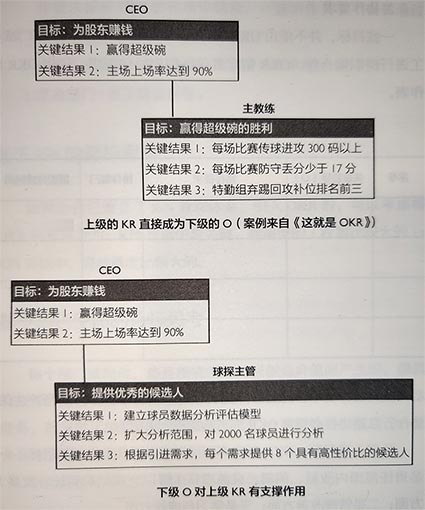

# 制定方式 #

### 公司目标 ###

可以参照[企业核心效益指标](../../util/cpc/index.md)去思考公司目标，各个指标可能的目标有：

1.市场地位。

扩大客户群体、增加客户购买、提高客户满意、提高社会形象。

2.创新业绩。

提升创新能力。

3.生产力。

实现卓越运营、优化客户管理、建设高效信息平台。

4.对优秀人才的吸引力。

打造优秀人才队伍、激活组织活力。

5.支付能力和流动资金。

提高股东价值。

6.盈利能力。

改善成本结构、提高销售收入。

基于[企业核心效益指标](../../util/cpc/index.md)分析出来的目标数量可能很多，但OKR要求聚焦，这就涉及目标取舍关系：当前形势下，哪些效益指标是最迫切需要提高的，与之有关的目标就是这个周期内，最具价值、最需要投入精力的。

一般来说，要有盈利能力和提升市场地位有关的目标。另外，相似的目标或具有直接逻辑支撑关系的目标可以合并。

### 部门 / 员工目标 ###

这个层级的目标来自三个方面：上级目标的分解、部门/员工之间协作要求和部门/员工自己提出的目标。

1.上级目标的分解

该分解方式遵循三点原则：一是上级的OKR直接由下级全部承接负责；二是上级OKR的KR成为下级的O；三是下级的O对上级的KR有支撑作用（只有部分影响）。

以下示例是对球队球探主管OKR的可能设定。它的目标“提供优秀的候选人”是支撑“赢得超级碗”的，但对其影响作用有限。

2.协作要求

目标尽量在OKR责任者的可控范围之内，最好能独立完成。但是在实际工作中，总会有些目标需要其他部门或员工跨职能合作。

这时OKR制定者可以提出协作要求，列出OKR协作表。

这种协作，需要符合两点要求：一是为完成OKR所产生的协作；二是协作必须对OK完成是重点、关键的。

3.基于角色使命的目标思考

每个部门或岗位，都是围绕组织如何创造价值而产生的，都具有独特的角色和使命。我们要始终提醒自己：任务是为了更好地完成使命和价值产生的。

<!-- 

### 承载战略 ###

OKR绝不应该在真空中创建，它必须把企业战略转化为行动。战略让你保持正确地方向，OKR给你明确的里程碑，让你更专注。

实行OKR却没有战略，就好像有了汽油却没有飞机一样不仅会让公司管理混乱、方向不明确，甚至还有潜在的危机。

当你有了战略，再去确定某个周期的目标，指向性就会明确得多。你再也不会觉得什么事情都需要做，你会知道自己什么时候应该做什么事情，一切都在计划之中。 -->
